# ⚒ ACG · Guild HMI — `teslasolar` monitoring fork

<div align="center"></div>

<div align="center">

**🔧 fork · SCADA control layer**
&nbsp;[](https://teslasolar.github.io/aicraftspeopleguild.github.io/)
[](https://github.com/teslasolar/aicraftspeopleguild.github.io/commits)
[](https://github.com/teslasolar/aicraftspeopleguild.github.io/pulse)
[](https://github.com/teslasolar/aicraftspeopleguild.github.io/issues)
[](https://github.com/teslasolar/aicraftspeopleguild.github.io)

**🏛 origin · the plant being watched**
&nbsp;[](https://aicraftspeopleguild.github.io/)
[](https://github.com/aicraftspeopleguild/aicraftspeopleguild.github.io/commits)
[](https://github.com/aicraftspeopleguild/aicraftspeopleguild.github.io/graphs/contributors)
[](https://github.com/aicraftspeopleguild/aicraftspeopleguild.github.io/stargazers)
[](https://github.com/aicraftspeopleguild/aicraftspeopleguild.github.io/network/members)

</div>

> **What you're looking at.** The `teslasolar` monitoring fork of [aicraftspeopleguild.github.io](https://aicraftspeopleguild.github.io). Origin is a flat collection of hand-authored HTML (charter · manifesto · code-of-conduct · papers · member cards). This fork wraps origin in a live **ISA-95 control plane** — every SVG below reads live data, every widget is a registered UDT, and a robot-dog police officer named **SPOT** walks a beat across origin every 15 minutes, barking into `state.db.faults` the moment it catches prompt-injection, leaked secrets, broken links, manifesto tampering, or rogue tag-type declarations. The SCADA tree is fork-exclusive by design; it isn't meant to be upstreamed — this repo *is* the control system.

**TL;DR**
- **ISA-95 layout** — L0 sensors · L1 PLC · L2 HMI · L3 pipeline · L4 API. Each layer is a real directory under [`guild/Enterprise/`](guild/Enterprise/).
- **Tag bus** — `state.db` (values · history · faults · tool-runs) bridged to **GitHub Issues** as the public tag registry. Every tag is a labelled issue; comments are history.
- **17 live SVGs** — each is an [`SvgOrganism`](guild/Enterprise/L4/svg/instances/organisms/) UDT. Regenerated on every push, every 15 min, and every `demo.heartbeat` bump.
- **🐕 SPOT patrol** — 6-beat security sweep of origin (heartbeat · links · prompt-injection · crypto · manifesto · tag types). Results route into the 🔔 alarms HMI with zero extra glue. [See it live ↗](https://teslasolar.github.io/aicraftspeopleguild.github.io/guild/Enterprise/L2/scada/spot/)
- **No backend** — Pages-served static JSON + SVG. `curl` works, CORS is open, everything is auditable.

**Contents** —
[🐕 SPOT](#-spot--the-robot-dog-police-officer-patrolling-origin) ·
[▣ dashboard](#-the-one-glance-scada-dashboard) ·
[💓 heartbeat](#-heartbeat--the-pulse) ·
[📈 tags](#-dynamic-tags--github-issues-as-a-db) ·
[⌨ cmd](#-drive-it--click-a-button-file-a-command) ·
[🧠 WebLLM](#-talk-to-it--webllm--terminal) ·
[🎲 papers](#-paper-roulette) ·
[👥 members](#-members) ·
[🖼 gallery](#-widget-gallery--every-svgorganism-in-tagdb) ·
[📡 API](#-api--static-json-cors-open) ·
[🎛 jump in](#-jump-in) ·
[🛠 run locally](#-run-it-locally)

> Every SVG on this page is regenerated by [`.github/workflows/heartbeat.yml`](.github/workflows/heartbeat.yml) on every push to main + every 15 minutes — reading live public API endpoints, the `state.db` runtime store, and the GitHub-Issue tag bus. Scroll through — everything you see was current the last time the heartbeat ticked.

---

## 🧬 where you are

<div align="center"></div>

A static GitHub Pages site organized as an ISA-95 control plane. Every tier above is a real directory under `guild/Enterprise/` and every block in the SVG is a clickable deep-link to it.

---

## ▣ the one-glance SCADA dashboard

<div align="center"><a href="https://teslasolar.github.io/aicraftspeopleguild.github.io/guild/apps/terminal/"></a></div>

One SVG. Eight framed panels. Reads `/api/health.json`, `/runtime/tags.json`, `/api/state.json`, `/api/spot-patrol.json`, local `state.db.pipeline_runs`, and the GitHub-Issue tag bus. Plant-state mega-lamp in the header aggregates SPOT's worst beat + active faults. Click it to open the live terminal.

---

## 🐕 SPOT · the robot-dog police officer patrolling origin

<div align="center"><a href="https://teslasolar.github.io/aicraftspeopleguild.github.io/guild/Enterprise/L2/scada/spot/"></a></div>

**This fork *is* the control layer.** Origin (`aicraftspeopleguild.github.io`) is a flat collection of hand-authored HTML — charter, manifesto, code of conduct, papers, member cards. There's no SCADA surface upstream; the entire ISA-95 tree under `guild/Enterprise/` lives only here in `teslasolar`, by design, because the fork's job is to **watch** the plant, not replicate into it.

SPOT is the sensor dog that walks a beat every 15 minutes on the 7/22/37/52 cron (offset from the mirror refresh so they don't collide) and on every `demo.heartbeat` bump:

| beat | what it checks on origin | alarm condition |
|---|---|---|
| `origin-heartbeat` | root HTML sha256 + byte size | unreachable, or churn past a baseline |
| `link-health` | 8 canonical pages (charter · code-of-conduct · manifesto · mission · white-papers · members · hall-of-fame · manifesto) | any non-2xx · warn if >2.5s |
| `html-scan` | same pages, stripped of `<script>`/`<style>` | prompt-injection patterns (DAN, "ignore previous", `[[system]]`, `<im_start>`, …) or leaked secrets (AWS / GitHub / OpenAI / Anthropic / PEM / JWT) |
| `manifesto-hash` | sha256 of `aicraftspeopleguild-manifesto.html` vs baseline in `spot-baselines.json` | any change = `TAMPER` alarm |
| `manifesto-sheet` | optional Google Sheets sign-on CSV (`SPOT_MANIFESTO_SHEET_ID`) | sign-in HTML returned instead of CSV · signer count drops below `min_rows` |
| `isa-61131` | **the fork's own** `runtime/tags.json` (self-check — origin has no tag surface) | any tag `.type` outside the ACG vocab + IEC 61131-3 elementary set |

Each non-green beat writes a fault into `state.db.faults` under the `scada.spot.*` tag prefix, so it lights up the **🔔 alarms** annunciator HMI without any extra wiring. Retired-beat faults auto-clear on the next sweep. Click the panel above to open the **[live SPOT page](https://teslasolar.github.io/aicraftspeopleguild.github.io/guild/Enterprise/L2/scada/spot/)** — 5-second polling of `spot-patrol.json`, full beat grid, dog lamp, footer links to the manifest / JSON log / SVG / baselines.

### ⚒ fork vs origin — raw drift

<div align="center"></div>

SPOT's interpretive companion. Where SPOT answers *"is origin healthy against my rules?"*, `fork-compare` shows raw side-by-side surface state: fork's heartbeat vs origin's, fork's paperCount vs origin's paperCount (which stays `—` because origin has no L4 API — that's expected and structural, not a fault), fork's last commit vs origin's last commit. Refreshed by `mirror.yml` every 15 minutes on the canonical `*/15` cron.

---

## 💓 heartbeat · the pulse

<div align="center"><a href="https://teslasolar.github.io/aicraftspeopleguild.github.io/guild/apps/terminal/"></a></div>

`tag:demo.heartbeat` is [issue #4](https://github.com/teslasolar/aicraftspeopleguild.github.io/issues?q=is:issue+label:tag+%22tag:demo.heartbeat%22). Every push bumps its value (epoch seconds), appends a history comment, and regenerates every SVG on this page. Open the terminal and run `watch demo.heartbeat` to see the next bump land within 15 seconds of the workflow finishing.

---

## 📈 dynamic tags · GitHub Issues as a DB

Tags aren't in a config file — each one is a labelled GitHub Issue. Title `tag:<path>`, body JSON `{value,quality,type,updated_at}`, comments are append-only history. Reads use the unauthenticated API; writes happen through the `cmd` panel below or the `gh-tag:write` tool.

<div align="center"></div>

<div align="center"></div>

The **top SVG** is the live list of open `label:tag` issues (fetched from the GitHub API). The **bottom SVG** is a rolling feed of the most recent writes from `state.db.tag_history` — every time a tag changes, one row gets appended there.

---

## ⌨ drive it · click a button, file a command

<div align="center"></div>

Each button is an anchor inside the SVG pointing at a **pre-filled `issues/new` URL**. Click → GitHub opens the form → Submit → the [`cmd` workflow](.github/workflows/cmd.yml) reads the title, dispatches the matching action, comments a receipt, and auto-closes the issue. Currently wired:

| title | action |
|---|---|
| `cmd:bump-heartbeat` | fresh 💓 timestamp → all 17 SVGs rerender (incl. SPOT + fork-compare) |
| `cmd:rebuild-svgs` | regenerate every `SvgOrganism` without bumping |
| `cmd:rebuild-api` | `init-db` + `build-api` + `build-runtime-tags` + `build-state` |
| `cmd:clear-faults` | clear every active fault in `state.db` |
| `cmd:tag-write path=<p> value=<v>` | update any GitHub-Issue tag |

---

## 🧠 talk to it · WebLLM + terminal

<div align="center"><a href="https://teslasolar.github.io/aicraftspeopleguild.github.io/guild/Enterprise/L4/sandbox/web-llm/"></a></div>

A quantized LLM (Phi-3-mini / Llama-3.2) running **entirely in your browser** via WebGPU. First load downloads the model into IndexedDB (~1-2 GB), subsequent chats are instant. The session speaks the same `t:'msg'` wire format as the P2P chat mesh, so peers in the same room can see each other's conversation.

<div align="center"><a href="https://teslasolar.github.io/aicraftspeopleguild.github.io/guild/apps/terminal/"></a></div>

For a keyboard-first view: the **live terminal** runs `acg health`, `acg tag:read`, `acg chat <msg>`, `acg watch <tag>` straight against the Pages endpoints and the GitHub API. Share a room URL `#room=<name>` and two visitors' terminals chat through the existing mesh.

---

## 🎲 paper roulette

<div align="center"></div>

Deterministic seed = current heartbeat value. Click → opens that paper. Every bump picks a new one.

---

## 👥 members

<div align="center"></div>

Eight founding members joined against `/api/papers.json` by name substring → per-member paper count. Each card is a deep-link to the member profile.

---

## 🖼 widget gallery · every SvgOrganism in tag.db

<div align="center"></div>

Every row is an `SvgOrganism` UDT in `tag.db.udts` (17 at the time of writing — some rendered inline above, others like `status-dashboard` and `pipeline-pulse` are live-only and click through from here). One `acg build:svg-all` call regenerates all of them. Add a new dashboard by dropping a Python generator at `guild/Enterprise/L4/svg/build-<name>.py` + an instance JSON at `guild/Enterprise/L4/svg/instances/organisms/<name>.json`; the heartbeat workflow picks it up on the next bump — no list to maintain.

---

## 📡 API · static JSON, CORS open

<div align="center"></div>

Every endpoint is rebuilt on every push and served directly from Pages. No backend, no auth.

```bash
curl https://teslasolar.github.io/aicraftspeopleguild.github.io/guild/Enterprise/L4/api/health.json
# → {"paperCount":24, "memberCount":8, "lastUpdated":"...", "apiVersion":"1.0"}

curl https://teslasolar.github.io/aicraftspeopleguild.github.io/guild/Enterprise/L4/runtime/tags.json \
  | jq '.enterprise'
# → live enterprise counters (papers · members · programs · runs · tagEdges · authoredLinks)

curl https://teslasolar.github.io/aicraftspeopleguild.github.io/guild/Enterprise/L4/api/state.json \
  | jq '.summary'
# → {"tag_values":..., "events":..., "tool_runs":..., "faults_active":..., ...}

curl https://teslasolar.github.io/aicraftspeopleguild.github.io/guild/Enterprise/L4/api/spot-patrol.json \
  | jq '{worst, summary, beats: [.beats[] | {id, status, detail}]}'
# → last SPOT sweep — worst status, ok/warn/alarm tally, one line per beat
```

---

## 🎛 jump in

<div align="center"></div>

| page | |
|---|---|
| [`/`](https://teslasolar.github.io/aicraftspeopleguild.github.io/) | Guild landing |
| [`/guild/Enterprise/L2/scada/spot/`](https://teslasolar.github.io/aicraftspeopleguild.github.io/guild/Enterprise/L2/scada/spot/) | 🐕 **SPOT** — live patrol grid, 5-second polling of `spot-patrol.json` |
| [`/guild/Enterprise/L2/scada/alarms/`](https://teslasolar.github.io/aicraftspeopleguild.github.io/guild/Enterprise/L2/scada/alarms/) | 🔔 alarms annunciator (active faults, filter by severity, ack) |
| [`/guild/apps/terminal/`](https://teslasolar.github.io/aicraftspeopleguild.github.io/guild/apps/terminal/) | ACG CLI in the browser + chat bridge |
| [`/guild/apps/whiteboard/`](https://teslasolar.github.io/aicraftspeopleguild.github.io/guild/apps/whiteboard/) | P2P collaborative whiteboard |
| [`/guild/apps/p2p/`](https://teslasolar.github.io/aicraftspeopleguild.github.io/guild/apps/p2p/) | Raw mesh (WebRTC + WebTorrent tracker) |
| [`/guild/Enterprise/L4/sandbox/web-llm/`](https://teslasolar.github.io/aicraftspeopleguild.github.io/guild/Enterprise/L4/sandbox/web-llm/) | WebLLM sandbox |
| [`/guild/Enterprise/`](https://teslasolar.github.io/aicraftspeopleguild.github.io/guild/Enterprise/) | Enterprise controls · NESW dock |
| [`/sitemap.xml`](https://teslasolar.github.io/aicraftspeopleguild.github.io/sitemap.xml) | Full sitemap |

---

## 🛠 run it locally

```bash
# 1. clone the FORK (origin has no SCADA tree — it's flat HTML only)
git clone https://github.com/teslasolar/aicraftspeopleguild.github.io.git
cd aicraftspeopleguild.github.io
python -m http.server 8765        # or ./README.sh  /  README.bat

# 2. rebuild everything (14-step tag-driven pipeline)
python bin/acg pipeline:run id=build

# 3. regenerate every SvgOrganism (17 widgets, incl. SPOT + fork-compare)
python bin/acg build:svg-all

# 4. run SPOT once against origin and see which beats are green
python guild/Enterprise/L4/svg/build-spot-patrol.py
cat guild/Enterprise/L4/api/spot-patrol.json | jq '{worst, summary}'

# 5. write a tag (requires `gh` CLI auth or GITHUB_TOKEN env)
python bin/acg gh-tag:write path=my.tag value=42 type=Counter

# 6. watch a tag live (terminal or Pages URL)
python bin/acg state:fire tag=my.tag to_state=CHANGED

# 7. inspect active SPOT faults in state.db
python -c "import sys; sys.path.insert(0, 'guild/Enterprise/L2/lib'); \
  import state_db; \
  [print(f) for f in state_db.list_faults()['faults'] \
     if f['tag'].startswith('scada.spot.')]"
```

<details><summary>how it fits together</summary>

- **`guild/Enterprise/L0..L4/`** — ISA-95 layout. L2 = HMI runtime + SCADA, L3 = build pipeline + UDTs, L4 = public API + SVG generators.
- **`tag.db`** — consolidated SQLite catalog of every UDT instance + script event + dir-local tag rollup. Regen with `acg build:tag-dbs`. Holds the `SvgOrganism` registry that `svg_build_all` iterates.
- **`state.db`** (`guild/Enterprise/L2/state/state.db`) — runtime Value/Quality/Timestamp store, `tag_history`, `pipeline_runs`, `faults`, `tool_runs`, `events`. Every write goes through `state_db.py`. SPOT's `bark.py` reconciles beat results into `faults` under the `scada.spot.*` tag prefix.
- **`docs.db`** — consolidated document index (912 docs · 949 headings · 338 links) with preserve-on-regen archival.
- **`bin/acg`** — Python-stdlib CLI dispatcher over 60+ Tool UDTs (`udt:list` / `udt:read` the catalog).
- **`guild/apps/`** — browser-side apps (terminal, whiteboard, p2p mesh, whitepapers reader).
- **`guild/Enterprise/L2/scada/spot/`** — SPOT patrol agent. `beats.py` registry, `patrol.py` runner, `bark.py` alarm bridge, `beats.json` manifest. Baselines persist in `guild/Enterprise/L4/runtime/spot-baselines.json`.
- **SVG widget library** at `guild/Enterprise/L2/lib/svg_widget.py` — atom / molecule / organism primitives. Each generator in `guild/Enterprise/L4/svg/build-*.py` writes one SVG to `guild/Enterprise/L2/hmi/web/assets/svg/*.svg`, registered via a JSON spec under `guild/Enterprise/L4/svg/instances/organisms/`.
- **Workflows** — `.github/workflows/heartbeat.yml` (bumps demo.heartbeat → regenerates every organism), `spot.yml` (7/22/37/52 cron SPOT sweep), `mirror.yml` (every-15-min fork-compare refresh), `cmd.yml` (issue-driven command dispatch), `paper-index.yml`, `ios-testflight*.yml`.

</details>

---

## 📄 license

Content © 2026 AI Craftspeople Guild · MIT for code. The Guild welcomes reading, sharing, and thoughtful response.

*[Discussions](https://github.com/aicraftspeopleguild/aicraftspeopleguild.github.io/discussions) · [Issues](https://github.com/aicraftspeopleguild/aicraftspeopleguild.github.io/issues) · [Engineering docs](docs/engineering/) · [Component catalog](docs/engineering/component-catalog/)*

---

⚒ **Kindness, consideration, and respect.** ⚒
