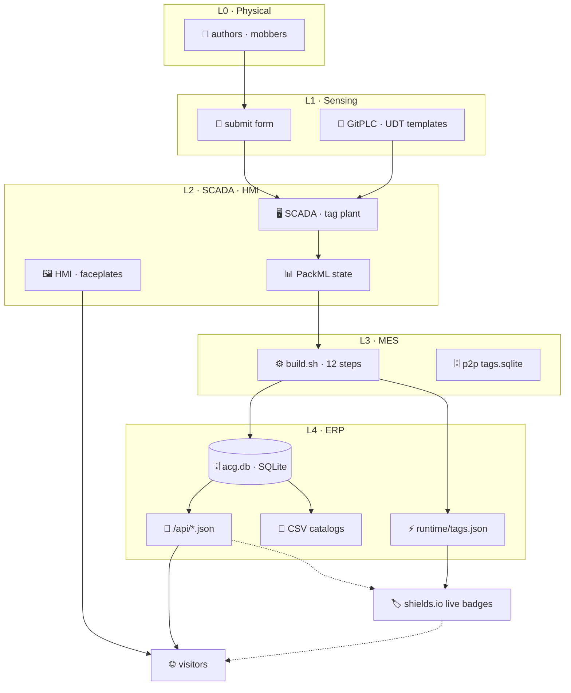

# ⚒ aicraftspeopleguild.github.io · Guild HMI

*AI Craftspeople Guild — the public Guild site, rendered as a live document-driven interface over an ISA-95 control-plane.*

<a href="https://aicraftspeopleguild.github.io/"></a>
<a href="https://aicraftspeopleguild.github.io/aicraftspeopleguild-manifesto.html"></a>
<a href="https://aicraftspeopleguild.github.io/guild/Enterprise/L1/forms/submit/"></a>
<a href="https://aicraftspeopleguild.github.io/guild/apps/p2p/"></a>
<a href="https://aicraftspeopleguild.github.io/guild/Enterprise/"></a>


---

## 📡 Live plant readout

Every badge below reads the live build artefacts on GitHub Pages — [`api/health.json`](guild/Enterprise/L4/api/health.json) and [`runtime/tags.json`](guild/Enterprise/L4/runtime/tags.json) — and rerenders on each page view. Edit the source UDTs, run `bash guild/web/scripts/build.sh`, push, and the HMI updates.

### 📚 catalog


### 🏭 enterprise tags (L4)


### ⚙ pipeline (L3 · build state)


### 📖 latest paper · 🌿 deploy


---

## 🎛 Controls

Every button below is an interactive entry point that mutates the Guild HMI. Submissions are rendered through [Level 1 sensing](docs/engineering/architecture/isa-95/level-1-sensing.md) forms → Level 2 SCADA → Level 3 build pipeline → Level 4 static JSON API.

[](https://aicraftspeopleguild.github.io/guild/Enterprise/L1/forms/submit/)
[](https://github.com/aicraftspeopleguild/aicraftspeopleguild.github.io/issues/new/choose)
[](https://github.com/aicraftspeopleguild/aicraftspeopleguild.github.io/discussions)
[](https://aicraftspeopleguild.github.io/guild/apps/p2p/)

<details><summary>🗂 Direct entry points</summary>

| Endpoint | Purpose |
|---|---|
| [`/`](https://aicraftspeopleguild.github.io/) | Guild landing — manifesto + nav |
| [`/guild/`](https://aicraftspeopleguild.github.io/guild/) | Operator index — 12-step pipeline, SCADA telemetry, ISA-95 levels |
| [`/guild/Enterprise/`](https://aicraftspeopleguild.github.io/guild/Enterprise/) | Enterprise controls landing (NESW dock) |
| [`/guild/apps/p2p/`](https://aicraftspeopleguild.github.io/guild/apps/p2p/) | P2P mesh app — browser chat, WebRTC, WebTorrent |
| [`/guild/apps/whitepapers/`](https://aicraftspeopleguild.github.io/guild/apps/whitepapers/) | White paper reader app |
| [`/guild/Enterprise/L4/api/papers.json`](https://aicraftspeopleguild.github.io/guild/Enterprise/L4/api/papers.json) | Static JSON API — papers |
| [`/guild/Enterprise/L4/api/members.json`](https://aicraftspeopleguild.github.io/guild/Enterprise/L4/api/members.json) | Static JSON API — members |
| [`/guild/Enterprise/L4/api/health.json`](https://aicraftspeopleguild.github.io/guild/Enterprise/L4/api/health.json) | Static JSON API — health |
| [`/sitemap.xml`](https://aicraftspeopleguild.github.io/sitemap.xml) | Full sitemap |

</details>

---

## 🧬 Architecture



Every page the public sees is a **view** over JSON-driven UDT instances. There is no hand-edited HTML page; all pages are rendered from view trees by [`guild/web/renderer.js`](guild/web/renderer.js) plus the perspective build in [`guild/web/scripts/perspective-build.js`](guild/web/scripts/perspective-build.js).

---

## 📁 Repo layout

```
⚒ aicraftspeopleguild.github.io/
├─ index.html                  🏠  Guild landing (JSON-rendered)
├─ papers.json                 📚  Canonical paper index (source of truth)
├─ sitemap.xml                 🌐  Auto-generated
├─ README.md                   …  this file
│
├─ docs/                       📐  Engineering + architecture docs
│   ├─ api-design.md · htmx-patterns.md · popcorn-flow-slides.*
│   └─ engineering/
│       ├─ architecture/       🏗  ISA-95 map · sitemap · P2P integration
│       │   └─ isa-95/         …  level-0…4, level-map
│       ├─ component-catalog/  🎨  every acg.display.* component
│       ├─ standards/          📖  Konomi · API · auto-index · submission
│       ├─ tech-spec/          📜  renderer · UDT system · UDT types
│       └─ urs/                ✅  user requirements spec
│
├─ guild/                      🏭  Guild runtime (ISA-95)
│   ├─ index.html              📟  operator dashboard
│   ├─ apps/
│   │   ├─ p2p/                🛰  peer-to-peer mesh chat (from teslasolar/ACGP2P)
│   │   ├─ whitepapers/        📘  white paper reader
│   │   └─ test/               🧪  ACG-Test runner (from teslasolar/ACG-Test)
│   ├─ Enterprise/             🎛  ISA-95 control-plane (shared)
│   │   ├─ L0/                 🧑‍🔧  human authoring
│   │   ├─ L1/                 📡  sensing (forms/ · plc/)
│   │   ├─ L2/                 🖥  scada/ · hmi/ · state/ · tag.db
│   │   ├─ L3/                 🗄  db/ (p2p tag snapshot)
│   │   ├─ L4/                 🏭  api/ · csv/ · database/ · runtime/ · sandbox/
│   │   └─ docs/standards/     📐  Konomi · GitPLC standards
│   └─ web/                    🎨  renderer + JSON view trees
│       ├─ renderer.js         🖌  SPA renderer
│       ├─ home.js             🏠  landing animation
│       ├─ components/         🧩  component registry + UDT instances
│       ├─ pages/              📄  *.page.json (one per route)
│       ├─ perspective/views/  🗂  view-tree compilations
│       ├─ members/            👥  per-member UDT instances
│       ├─ white-papers/       📚  per-paper UDT instances
│       └─ scripts/            ⚙  build pipeline (build.sh + Python/Node)
```

Full sitemap: [docs/engineering/architecture/sitemap.md](docs/engineering/architecture/sitemap.md) · ISA-95 level map: [docs/engineering/architecture/isa-95/level-map.md](docs/engineering/architecture/isa-95/level-map.md).

---

## 🏗️ Tech stack

- **JSON-driven SPA** — pages are `*.page.json` view trees rendered into the DOM by [`guild/web/renderer.js`](guild/web/renderer.js). No framework, no bundler for the runtime.
- **UDT system** — every content type (paper, member, component, program, path) is a User-Defined Type. Instances live as JSON under `guild/web/*/udts/instances/`. Builder scripts seed a SQLite ERP store from them.
- **Static JSON API** — [`guild/Enterprise/L4/api/*.json`](guild/Enterprise/L4/api/) is regenerated from the SQLite DB on every build and served as-is by GitHub Pages.
- **ISA-95 control-plane** — the Enterprise layer ([`guild/Enterprise/`](guild/Enterprise/)) is organised into L0-L4 folders that other Guild apps import.
- **Live HMI** — shields.io dynamic-JSON badges in this README read the live API, making the README itself a dashboard.

No `node_modules` lockfile committed. Build-time deps: Python 3.10+ (`markdown`), Node 18+ (plain JS builder). See [`guild/web/scripts/build.sh`](guild/web/scripts/build.sh).

---

## ⚙ Build · 12-step pipeline

```bash
# one-shot full rebuild:
bash guild/web/scripts/build.sh

# serve locally:
python3 -m http.server 8000
# open http://localhost:8000/
```

| Step | Command | What it does |
|------|---------|--------------|
| 1 | `components/extract.py` | Extract component UDTs from engineering docs |
| 2 | `components/build-catalog.py` | Build component UDT + tag catalog |
| 3 | `guild/Enterprise/L4/api/white-papers/ingest.py` | Rebuild white paper UDT instances |
| 4 | `scripts/apps/build-whitepaper-apps.py` | One App UDT per paper |
| 5 | `scripts/build.js` | Render view trees → `guild/web/dist/` |
| 6 | `white-papers/regen-index.py` + `members/regen-index.py` | Overlay index pages from UDTs |
| 7 | `build-programs.py` + `pages/build-path-graph.py` | Rebuild Program UDTs from PackML state |
| 8 | `perspective-build.js` | Render Perspective-schema views |
| 9 | `Enterprise/L4/database/init-db.py` + `db/build-local-tagdbs.py` | Seed SQLite databases |
| 10 | `api/build-api.py` | Emit `/api/*.json` |
| 11 | `api/build-runtime-tags.py` + `build-csv-catalog.py` + `build-sitemap.py` | Runtime tags · CSV · sitemap |
| 12 | *(done)* | `dist/` contains rendered pages |

---

## 📚 Key entry points

| I'm looking for… | Go here |
|---|---|
| What the Guild stands for | [Manifesto](https://aicraftspeopleguild.github.io/#/manifesto) · [Charter](https://aicraftspeopleguild.github.io/#/charter) · [Code of Conduct](https://aicraftspeopleguild.github.io/#/code-of-conduct) |
| Member practices | [AI Rituals](https://aicraftspeopleguild.github.io/#/rituals) · [Mob Programming](https://aicraftspeopleguild.github.io/#/mob-programming) · [Flywheel](https://aicraftspeopleguild.github.io/#/flywheel) |
| Who's in the Guild | [Members](https://aicraftspeopleguild.github.io/#/members) |
| Writing + critique | [White Papers](https://aicraftspeopleguild.github.io/#/white-papers) · [Hall of Fame](https://aicraftspeopleguild.github.io/#/hall-of-fame) · [Hall of Shame](https://aicraftspeopleguild.github.io/#/hall-of-shame) |
| How to submit | [Submission form](https://aicraftspeopleguild.github.io/guild/Enterprise/L1/forms/submit/) · [submission spec](docs/engineering/standards/article-submission.md) |
| Engineering architecture | [docs/engineering/](docs/engineering/) |
| Component catalog | [docs/engineering/component-catalog/](docs/engineering/component-catalog/) |
| Contribute a change | [PR #20](https://github.com/aicraftspeopleguild/aicraftspeopleguild.github.io/pull/20) · [Discussions](https://github.com/aicraftspeopleguild/aicraftspeopleguild.github.io/discussions) |

---

## 🌐 Glyphs

The Guild uses a shared glyph grammar across all its manifests and HMIs. The canonical decompressor lives in [`guild/Enterprise/docs/standards/`](guild/Enterprise/docs/standards/).

| glyph | meaning | glyph | meaning |
|---|---|---|---|
| 🏗️ | UDT (User-Defined Type) | 📦 | instance |
| 🏷️ | tag | 📋 | provider |
| 🖥 | SCADA / server view | 🖼 | HMI / operator view |
| 🔧 | PLC | 🛰 | gateway / mesh bridge |
| 💬 | chat  | 🧪 | sandbox |
| 📝 | form  | 📚 | catalog |
| 📡 | tracker / API | 🎛 | controls |
| 🟢 🟡 🔴 | tag quality | 和 | resonant / complete |

---

## 🤝 Contributing

1. **Read the manifesto** first — [`aicraftspeopleguild-manifesto.html`](aicraftspeopleguild-manifesto.html).
2. **Pick a channel:**
   - Writing → [submission form](https://aicraftspeopleguild.github.io/guild/Enterprise/L1/forms/submit/)
   - Code → open an [issue](https://github.com/aicraftspeopleguild/aicraftspeopleguild.github.io/issues/new/choose) or PR
   - Bigger ideas → [Discussions](https://github.com/aicraftspeopleguild/aicraftspeopleguild.github.io/discussions)
3. **Every content change seeds through UDT instances.** Don't edit rendered HTML in `guild/web/dist/` — edit the UDT JSON under `guild/web/*/udts/instances/` and re-run the build.
4. **Follow the palette.** Parchment · ink · rust · bronze · graphite. Playfair Display + Work Sans. The component catalog encodes the contract.

---

## 📄 License

Content © 2026 AI Craftspeople Guild · MIT for code. The Guild welcomes reading, sharing, and thoughtful response. For reuse of written Guild content beyond fair use, please open an issue and ask — we usually say yes.

---

⚒ **Kindness, consideration, and respect.** ⚒

