# ⚒ ACG · Guild HMI

<div align="center"></div>

> Every SVG on this page is regenerated by `.github/workflows/heartbeat.yml` on every push to main + every 15 minutes, reading the live public API, the `state.db` runtime store, and a dynamic tag database backed by **GitHub Issues**. Scroll through — everything you see was current the last time the heartbeat ticked.

---

## 🧬 where you are

<div align="center"></div>

A static GitHub Pages site organized as an ISA-95 control plane. Every tier above is a real directory under `guild/Enterprise/` and every block in the SVG is a clickable deep-link to it.

<div align="center"></div>

Network of how the subsystems actually feed each other — blue edges read, green write, orange trigger (event-driven).

---

## ▣ the one-glance SCADA dashboard

<div align="center"><a href="https://teslasolar.github.io/aicraftspeopleguild.github.io/guild/apps/terminal/"></a></div>

One SVG. Seven panels. Reads `/api/health.json`, `/runtime/tags.json`, `/api/state.json`, local `state.db.pipeline_runs`, and the GitHub-Issue tag bus. Click it to open the live terminal.

---

## 💓 heartbeat · the pulse

<div align="center"><a href="https://teslasolar.github.io/aicraftspeopleguild.github.io/guild/apps/terminal/"></a></div>

`tag:demo.heartbeat` is [issue #4](https://github.com/teslasolar/aicraftspeopleguild.github.io/issues?q=is:issue+label:tag+%22tag:demo.heartbeat%22). Every push bumps its value (epoch seconds), appends a history comment, and regenerates every SVG on this page. Open the terminal and run `watch demo.heartbeat` to see the next bump land within 15 seconds of the workflow finishing.

---

## 📈 dynamic tags · GitHub Issues as a DB

Tags aren't in a config file — each one is a labelled GitHub Issue. Title `tag:<path>`, body JSON `{value,quality,type,updated_at}`, comments are append-only history. Reads use the unauthenticated API; writes happen through the `cmd` panel below or the `gh-tag:write` tool.

<div align="center"></div>

<div align="center"></div>

The **top SVG** is the live list of open `label:tag` issues (fetched from the GitHub API). The **middle SVG** is a rolling feed of the most recent writes from `state.db.tag_history`.

<div align="center"></div>

The **heatmap** is a per-directory × UDT-type density grid pulled from `tag.db.udts`, log-scaled so a dir with one Tool UDT and one with two hundred both render legibly.

<div align="center"></div>

Every fault ever raised is a horizontal bar from `raised_at → cleared_at`. Active faults stay red on the right edge; cleared ones dim to gray.

---

## ⌨ drive it · click a button, file a command

<div align="center"></div>

Each button is an anchor inside the SVG pointing at a **pre-filled `issues/new` URL**. Click → GitHub opens the form → Submit → the [`cmd` workflow](.github/workflows/cmd.yml) reads the title, dispatches the matching action, comments a receipt, and auto-closes the issue. Currently wired:

| title | action |
|---|---|
| `cmd:bump-heartbeat` | fresh 💓 timestamp → all 15 SVGs rerender |
| `cmd:rebuild-svgs` | regenerate every `SvgOrganism` without bumping |
| `cmd:rebuild-api` | `init-db` + `build-api` + `build-runtime-tags` + `build-state` |
| `cmd:clear-faults` | clear every active fault in `state.db` |
| `cmd:tag-write path=<p> value=<v>` | update any GitHub-Issue tag |

---

## 🧠 talk to it · WebLLM + terminal

<div align="center"><a href="https://teslasolar.github.io/aicraftspeopleguild.github.io/guild/Enterprise/L4/sandbox/web-llm/"></a></div>

A quantized LLM (Phi-3-mini / Llama-3.2) running **entirely in your browser** via WebGPU. First load downloads the model into IndexedDB (~1-2 GB), subsequent chats are instant. The session speaks the same `t:'msg'` wire format as the P2P chat mesh, so peers in the same room can see each other's conversation.

<div align="center"><a href="https://teslasolar.github.io/aicraftspeopleguild.github.io/guild/apps/terminal/"></a></div>

For a keyboard-first view: the **live terminal** runs `acg health`, `acg tag:read`, `acg chat <msg>`, `acg watch <tag>` straight against the Pages endpoints and the GitHub API. Share a room URL `#room=<name>` and two visitors' terminals chat through the existing mesh.

---

## 🎲 paper roulette

<div align="center"></div>

Deterministic seed = current heartbeat value. Click → opens that paper. Every bump picks a new one.

---

## 👥 members

<div align="center"></div>

Eight founding members joined against `/api/papers.json` by name substring → per-member paper count. Each card is a deep-link to the member profile.

---

## 🖼 widget gallery · everything you saw above

<div align="center"></div>

Every row in the gallery is an `SvgOrganism` UDT in `tag.db.udts` — one `acg build:svg-all` call regenerates all of them. Add a new dashboard by dropping a new Python generator + an instance JSON; no list to maintain.

<div align="center"></div>

Live from the GitHub REST API — 12-week commit sparkline on the left, last 8 commits (sha · date · message) on the right.

---

## 📡 API · static JSON, CORS open

<div align="center"></div>

Every endpoint is rebuilt on every push and served directly from Pages. No backend, no auth.

```bash
curl https://teslasolar.github.io/aicraftspeopleguild.github.io/guild/Enterprise/L4/api/health.json
# → {"paperCount":24, "memberCount":8, "lastUpdated":"...", "apiVersion":"1.0"}

curl https://teslasolar.github.io/aicraftspeopleguild.github.io/guild/Enterprise/L4/runtime/tags.json \
  | jq '.enterprise'
# → live enterprise counters (papers · members · programs · runs · tagEdges · authoredLinks)

curl https://teslasolar.github.io/aicraftspeopleguild.github.io/guild/Enterprise/L4/api/state.json \
  | jq '.summary'
# → {"tag_values":..., "events":..., "tool_runs":..., "faults_active":..., ...}
```

---

## 🎛 jump in

<div align="center"></div>

| page | |
|---|---|
| [`/`](https://teslasolar.github.io/aicraftspeopleguild.github.io/) | Guild landing |
| [`/guild/apps/terminal/`](https://teslasolar.github.io/aicraftspeopleguild.github.io/guild/apps/terminal/) | ACG CLI in the browser + chat bridge |
| [`/guild/apps/whiteboard/`](https://teslasolar.github.io/aicraftspeopleguild.github.io/guild/apps/whiteboard/) | P2P collaborative whiteboard |
| [`/guild/apps/p2p/`](https://teslasolar.github.io/aicraftspeopleguild.github.io/guild/apps/p2p/) | Raw mesh (WebRTC + WebTorrent tracker) |
| [`/guild/Enterprise/L4/sandbox/web-llm/`](https://teslasolar.github.io/aicraftspeopleguild.github.io/guild/Enterprise/L4/sandbox/web-llm/) | WebLLM sandbox |
| [`/guild/Enterprise/`](https://teslasolar.github.io/aicraftspeopleguild.github.io/guild/Enterprise/) | Enterprise controls · NESW dock |
| [`/sitemap.xml`](https://teslasolar.github.io/aicraftspeopleguild.github.io/sitemap.xml) | Full sitemap |

---

## 🛠 run it locally

```bash
# 1. clone + serve
git clone https://github.com/aicraftspeopleguild/aicraftspeopleguild.github.io.git
cd aicraftspeopleguild.github.io
python -m http.server 8765        # or ./README.sh  /  README.bat

# 2. rebuild everything (14-step tag-driven pipeline)
python bin/acg pipeline:run id=build

# 3. regenerate every README SVG in one shot
python bin/acg build:svg-all

# 4. write a tag (requires `gh` CLI auth or GITHUB_TOKEN env)
python bin/acg gh-tag:write path=my.tag value=42 type=Counter

# 5. watch a tag live (terminal or Pages URL)
python bin/acg state:fire tag=my.tag to_state=CHANGED
```

<details><summary>how it fits together</summary>

- **`guild/Enterprise/L0..L4/`** — ISA-95 layout. L2 = HMI runtime, L3 = build pipeline, L4 = public API.
- **`tag.db`** — consolidated SQLite catalog of every UDT instance + script event + dir-local tag rollup. Regen with `acg build:tag-dbs`.
- **`state.db`** (`guild/Enterprise/L2/state/state.db`) — runtime Value/Quality/Timestamp store, `tag_history`, `pipeline_runs`, `faults`, `tool_runs`, `events`. Every write goes through `state_db.py`.
- **`docs.db`** — consolidated document index (912 docs · 949 headings · 338 links) with preserve-on-regen archival.
- **`bin/acg`** — Python-stdlib CLI dispatcher over 60+ Tool UDTs (`udt:list` / `udt:read` the catalog).
- **`guild/apps/`** — browser-side apps (terminal, whiteboard, p2p mesh, whitepapers reader).
- **SVG widget library** at `guild/Enterprise/L2/lib/svg_widget.py` — atom / molecule / organism primitives. Each generator in `guild/Enterprise/L4/svg/build-*.py` writes one SVG to `guild/Enterprise/L2/hmi/web/assets/svg/*.svg`.

</details>

<details><summary>repo stats (GitHub side)</summary>


</details>

---

## 📄 license

Content © 2026 AI Craftspeople Guild · MIT for code. The Guild welcomes reading, sharing, and thoughtful response.

*[Discussions](https://github.com/aicraftspeopleguild/aicraftspeopleguild.github.io/discussions) · [Issues](https://github.com/aicraftspeopleguild/aicraftspeopleguild.github.io/issues) · [Engineering docs](docs/engineering/) · [Component catalog](docs/engineering/component-catalog/)*

---

⚒ **Kindness, consideration, and respect.** ⚒
