# /guild/Enterprise/L2/scada/spot

<div align="center"></div>

> 🐕 **SPOT — the robot-dog police officer.** Walks a 6-beat patrol across origin every 15 minutes (cron 7/22/37/52) + on every `demo.heartbeat` bump. Barks into `state.db.faults` under the `scada.spot.*` tag prefix so the [alarms HMI](../alarms/) picks up hits with zero extra wiring.
>
> Breadcrumb: [`/`](../../../../../) · [`/guild/Enterprise/`](../../../) · [`/guild/Enterprise/L2/scada/`](../) · `spot/`

## Beats — what's being watched

| beat (id) | target | alarm condition |
|---|---|---|
| `origin-heartbeat` | `https://aicraftspeopleguild.github.io/` | non-2xx, or sha256 churn past baseline |
| `link-health` | 8 canonical origin pages (charter · code-of-conduct · manifesto · mission · white-papers · members · hall-of-fame) | any non-2xx (alarm) · >2.5s (warn) |
| `html-scan` | same pages, stripped of `<script>`/`<style>` | prompt-injection patterns · leaked secrets (AWS · GitHub · OpenAI · Anthropic · PEM · JWT) |
| `manifesto-hash` | `aicraftspeopleguild-manifesto.html` sha256 vs baseline | any change ⇒ `TAMPER` alarm |
| `manifesto-sheet` | Google Sheets CSV (optional, `SPOT_MANIFESTO_SHEET_ID`) | sign-in HTML returned · signers below `min_rows` |
| `isa-61131` | fork's own `runtime/tags.json` (self-check) | tag `.type` outside ACG vocab + IEC 61131-3 elementary set |

## Files

- [`patrol.py`](patrol.py) — runner. Loads `beats.json`, dispatches to the registry, writes JSON log + bark.
- [`beats.py`](beats.py) — beat implementations. Registry at the bottom; add a new beat here and wire it into `beats.json`.
- [`bark.py`](bark.py) — alarm bridge. Raises / clears `state.db.faults` under `scada.spot.*` per sweep result; orphan-sweeps retired beats.
- [`beats.json`](beats.json) — the manifest (which beats, which cfg, in what order).
- [`beats.schema.json`](beats.schema.json) — JSON-Schema for the manifest.
- [`index.html`](index.html) — live HMI page, 5-second polling of `../../../L4/api/spot-patrol.json`.

## Outputs & baselines

- `guild/Enterprise/L4/api/spot-patrol.json` — machine-readable last sweep.
- `guild/Enterprise/L2/hmi/web/assets/svg/spot-patrol.svg` — the dog dashboard.
- `guild/Enterprise/L4/runtime/spot-baselines.json` — persisted sha/size baselines for `origin-heartbeat` and `manifesto-hash`. Delete a key (or pass `"force_rebaseline": true` in `beats.json`) to re-baseline after an authorized edit.

## Run it

```bash
# single sweep (writes SVG, JSON, and bark-faults)
python guild/Enterprise/L4/svg/build-spot-patrol.py

# just the patrol (no SVG render)
python guild/Enterprise/L2/scada/spot/patrol.py

# inspect active SPOT faults
python -c "import sys; sys.path.insert(0,'guild/Enterprise/L2/lib'); \
  import state_db; [print(f) for f in state_db.list_faults()['faults'] \
     if f['tag'].startswith('scada.spot.')]"
```

## Workflow

- [`.github/workflows/spot.yml`](../../../../.github/workflows/spot.yml) — `cron: 7,22,37,52 * * * *` + push-triggered. Commits changed `spot-patrol.svg` + `spot-patrol.json` + `spot-baselines.json` if anything changed.
- UDTs: [`build-svg-spot-patrol`](../../../L3/udts/tool/instances/build-svg-spot-patrol.json) (Tool) · [`spot-patrol-on-cron`](../../../L3/udts/script/instances/spot-patrol-on-cron.json) · [`spot-patrol-on-push`](../../../L3/udts/script/instances/spot-patrol-on-push.json).
